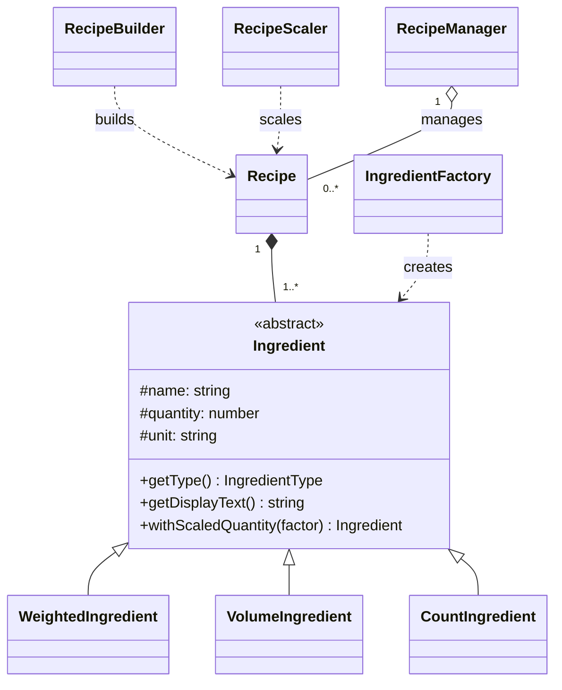

# Recipe & Ingredient Scaler

ระบบจัดการสูตรอาหารและคำนวณปริมาณวัตถุดิบตามจำนวนเสิร์ฟ พัฒนาด้วย React + TypeScript โดยประยุกต์ใช้แนวคิด Object-Oriented Programming (OOP) และ Builder Pattern

## Project Status

> **Current Stage: Final Integration / Testing**

ฟังก์ชันหลักของระบบสามารถใช้งานผ่าน GUI ได้แล้ว โครงสร้าง OOP และ business logic ถูกแยกออกจาก React และมี automated tests สำหรับ core flow

### ฟังก์ชันที่ทำแล้ว

- [x] สร้าง / แก้ไข / ลบสูตรอาหารผ่าน GUI
- [x] เพิ่ม / แก้ไข / ลบวัตถุดิบในสูตร
- [x] ค้นหาสูตรอาหารตามชื่อ
- [x] เรียงสูตรตามล่าสุด / ชื่อ / จำนวนเสิร์ฟ
- [x] คำนวณสัดส่วนวัตถุดิบตามจำนวนเสิร์ฟใหม่
- [x] ยืนยันก่อนลบสูตร
- [x] บันทึกและโหลดข้อมูลด้วย LocalStorage
- [x] Validation ข้อมูลพื้นฐาน
- [x] ใช้ Builder Pattern ใน application flow
- [x] ใช้ Encapsulation, Inheritance และ Polymorphism ใน core model
- [x] เลือกประเภทวัตถุดิบอัตโนมัติจากหน่วย
- [x] แยก CRUD / Search / Sort ไว้ใน RecipeManager
- [x] รองรับการย้ายข้อมูล LocalStorage รูปแบบเดิม
- [x] เลื่อนไปฟอร์มแก้ไขและกลับมายังสูตรเดิมอัตโนมัติ

## Core Features

### 1. Recipe Management
ผู้ใช้สามารถ

- สร้างสูตรใหม่
- แก้ไขสูตรเดิม
- ลบสูตร
- ค้นหาสูตร
- เรียงลำดับสูตร

### 2. Ingredient Management
แต่ละสูตรสามารถมีวัตถุดิบหลายรายการ โดยระบุ

- ชื่อวัตถุดิบ
- ปริมาณ
- หน่วย

ระบบเลือก `WeightedIngredient`, `VolumeIngredient` หรือ `CountIngredient` จากหน่วยโดยอัตโนมัติ ผู้ใช้ไม่ต้องเลือกประเภทเอง และสามารถแก้ไขหรือลบรายการก่อนบันทึกสูตรได้

### 3. Recipe Scaling
ระบบสามารถคำนวณปริมาณวัตถุดิบใหม่จากจำนวนเสิร์ฟเป้าหมาย

สูตรที่ใช้:

```text
scaleFactor = targetServings / originalServings
newQuantity = originalQuantity * scaleFactor
```

ตัวอย่าง:

```text
Original Servings: 2
Target Servings:   6

Pork: 200 g -> 600 g
Milk: 300 ml -> 900 ml
```

### 4. Local Storage
สูตรอาหารถูกบันทึกไว้ใน LocalStorage ของ browser ทำให้ reload หน้าเว็บแล้วข้อมูลยังคงอยู่

ข้อมูลใช้ schema version 2 และสามารถย้ายข้อมูลเดิมแบบ `solid/liquid` เป็นประเภทใหม่โดยอ้างอิงจากหน่วยได้อัตโนมัติ

> หากล้างข้อมูลเว็บไซต์หรือ LocalStorage สูตรที่บันทึกไว้อาจหาย

## OOP Design

### Class ที่ใช้งานจริงในระบบ

```text
Ingredient
├── WeightedIngredient
├── VolumeIngredient
└── CountIngredient

Recipe

RecipeBuilder
└── builds Recipe

IngredientFactory
└── creates Ingredient subtype from unit

RecipeScaler
├── uses Recipe
└── uses RecipeBuilder

RecipeManager
└── manages Recipe[]
```

### Class Diagram



### Encapsulation

`Recipe` ซ่อนข้อมูลภายในด้วย `private`

```ts
private name: string
private servings: number
private ingredients: Ingredient[]
private id: string
```

และเข้าถึงข้อมูลผ่าน methods เช่น

```ts
getName()
getServings()
getIngredients()
```

`Ingredient` ใช้ `protected` เพื่อให้ subclass สามารถใช้งานข้อมูลภายในได้ แต่ code ภายนอกไม่สามารถเข้าถึง field โดยตรง

### Inheritance

```text
Ingredient
├── WeightedIngredient
├── VolumeIngredient
└── CountIngredient
```

Subclass ทั้งสามสืบทอดข้อมูลและ validation ร่วมกันจาก abstract class `Ingredient` โดยแบ่งตามวิธีวัดที่ใช้จริงในระบบ

### Polymorphism

Subclass override methods ของ `Ingredient`

```ts
getDisplayText()
withScaledQuantity()
```

ตัวอย่างการใช้งานใน `RecipeScaler`

```ts
ingredient.withScaledQuantity(scaleFactor)
```

`RecipeScaler` ไม่จำเป็นต้องรู้ว่า object เป็น subclass ใด แต่เรียก method ผ่านชนิด `Ingredient` ได้โดยตรง และยังคง subtype เดิมหลัง scale

### Builder Pattern

`RecipeBuilder` ใช้สำหรับประกอบ Recipe ทีละขั้น โดยเฉพาะรายการ ingredients ที่มีจำนวนไม่แน่นอน

```ts
const recipe = new RecipeBuilder()
  .setName("Pancake")
  .setServings(2)
  .addIngredient(...)
  .addIngredient(...)
  .build()
```

Builder ช่วยรวมขั้นตอนการสร้างและ validation ก่อนสร้าง `Recipe` ที่สมบูรณ์

## Project Structure

```text
src/
├── components/
│   ├── DeleteConfirmModal.tsx
│   ├── Header.tsx
│   ├── RecipeCard.tsx
│   ├── RecipeForm.test.tsx
│   ├── RecipeForm.tsx
│   └── ScaleModal.tsx
│
├── core/
│   ├── builders/
│   │   └── RecipeBuilder.ts
│   │
│   ├── factories/
│   │   └── IngredientFactory.ts
│   │
│   ├── models/
│   │   ├── CountIngredient.ts
│   │   ├── Ingredient.ts
│   │   ├── Recipe.ts
│   │   ├── VolumeIngredient.ts
│   │   └── WeightedIngredient.ts
│   │
│   ├── services/
│   │   ├── RecipeManager.ts
│   │   └── RecipeScaler.ts
│   │
│   └── core.test.ts
├── storage/
│   └── recipeStorage.ts
│
├── utils/
│   ├── scrollToTarget.test.ts
│   └── scrollToTarget.ts
│
├── App.tsx
├── App.css
├── index.css
└── main.tsx
```

## Technology Stack

- React
- TypeScript
- Vite
- CSS
- LocalStorage
- Git / GitHub

## Team Roles

### Person 1 — OOP / Architecture Developer
รับผิดชอบ

- Core OOP architecture
- Recipe / Ingredient models
- Inheritance / Polymorphism
- RecipeBuilder
- RecipeManager interface design
- Class Diagram
- OOP explanation สำหรับ presentation

### Person 2 — Logic Developer / Tester
รับผิดชอบ

- RecipeScaler
- RecipeManager implementation
- IngredientFactory / unit mapping
- Scaling logic
- Validation
- Test cases
- Edge cases
- Integration testing

### Person 3 — Frontend / UXUI Developer
รับผิดชอบ

- React GUI
- Recipe form
- Recipe cards
- Search / Sort
- Modal interactions
- LocalStorage integration
- UX/UI

สมาชิกทุกคนช่วยกันทำ Integration, Bug Fix และ Presentation

## How to Run

ติดตั้ง dependencies

```bash
npm install
```

รัน development server

```bash
npm run dev
```

ตรวจ lint

```bash
npm run lint
```

รัน automated tests

```bash
npm test
```

สร้าง production build

```bash
npm run build
```

## Current Improvement Tasks

ก่อน Final Presentation ทีมกำลังตรวจและปรับปรุงเรื่องต่อไปนี้

- [x] ปรับ Ingredient inheritance ตามประเภทการวัด
- [x] แยก CRUD / Search / Sort ออกจาก `App.tsx`
- [x] จัดทำ Class Diagram ให้ตรงกับ code ล่าสุด
- [x] เพิ่ม automated tests สำหรับ core logic และ storage migration
- [x] ใช้คำว่า "จำนวนเสิร์ฟ" เป็นหลักใน GUI
- [ ] ตรวจ responsive และ UX/UI
- [ ] Final integration test
- [ ] เตรียม Presentation และ Demo

## Final Demo Flow

```text
Create Recipe
    ↓
Add / Edit Ingredients
    ↓
Save
    ↓
Search / Sort
    ↓
Edit Recipe
    ↓
Scale Servings
    ↓
Reload Browser
    ↓
Load from LocalStorage
    ↓
Delete Recipe
```

## Notes

ก่อนนำเสนอให้รัน `npm test`, `npm run lint`, `npm run build` และทดลอง Final Demo Flow บน browser อีกครั้ง
